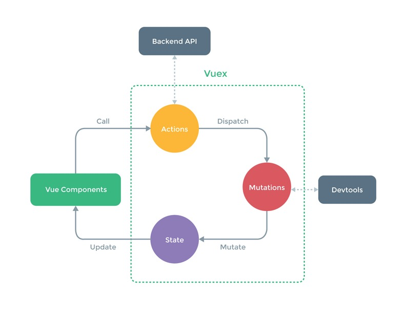

### Vuex基础知识
#### 安装部分
##### 如果是在Vue之后引入`vuex`,那么vuex就会自动安装
```javascript
<script src="/path/to/vue.js"></script>
<script src="/path/to/vuex.js"></script>
```
##### 使用NPM方式进行安装
```javascript
npm install vuex --save
// 这里要注意的是后面一定要加上 --save,因为这个包我们是要在生产环境中用到的.
```
#### Vuex是什么?
#####  Vuex是一个专门为Vue.js应用程序开发的状态管理模式.采用集中式存储管理应用的所有组件的状态.可以想象成一个'前端数据库',让其在各个页面上实现数据共享,并且可以操作.
##### `通常如果是小型项目(项目复杂度低)的时候,一般会利用全局事件总线来(global event bus)解决问题.`使用vuex会显的比较冗余.

#### Vuex可以分成四个部分:
- State:        单一的状态树
- Getters:      状态获取
- Mutations:    触发提交事件
- Actions:      提交Mutations,可以包含异步操作

##### 根据以上得图片可以看得出,Vuex得数据总是'单向流动',也就是单向数据流.
- 用户访问页面触发action
- action 提交mutation事件
- mutation事件更改state状态
- state状态变更后再更新 Vue Components
##### Vuex规定,属于应用层级得状态通过Mutation中得方法来修改,而派发Mutation中的事件只能由action来做.
##### 具体的用用法是: `根据上图的步骤,从左到右,从组件出发,Vue Components调用action,在action这一层,我们可以和后台进行交互,比如获取初始化的数据源,或者中间数据过滤等.然后再action中派发给Mutation.Mutation触发状态的改变,状态的改变,直接触发试图的更新.`
#### 需要注意的是:
- 数据流都是单向的
- 组件能够调用 action
- action用来派发Mutation
- 只有Mutation才可以改变状态,进而视图更新
- store是响应式的,无论store什么时候更新,组件都将同步的更新.

#### State
##### store中的state对象, 你可以理解为是`Vue`实例中的`data`对象,state用来保存最基础的数据.
```javascript
import Vue from 'vue';
import Vuex from 'vuex';

//使用vuex，引入之后用Vue.use进行引用。
Vue.use(Vuex);

//用export default封装代码,这样可以让外部引用到.
let store =  new Vue.store({
    state: {
        stateA: 'start',
        stateB: 'stop'
    }
})
console.log(store.state.stateA)
//start
```
##### 在vue模板中查看store得状态
```html
<!-- 这里你可以使用store.state来获取状态对象,通过store.commit()方法来触发状态变更 -->
<button @click="$store.commit('add')">+</button>
<h3>{{$store.state.count}}</h3>
<button @click="$store.commit('reduce')"> -</button>
<h2>{{msg}}</h2><hr/>
```
#### state访问状态对象
##### 上面写的const state,就是我们这里要说的访问状态对象,就是SPA中共享的值.这里要学习的就是状态对象赋值给内部对象的,也就是store.js中的state值赋值给模板中data中的值,这里只有三种赋值方式:
##### 一. 通过computed计算属性直接赋值
```javascript
computed: {
    count(){
        return this.$store.state.count
    }
  },
//这里要注意的是return this.$store.state.count这句,一定要写this,不让访问不到$store的.
```
##### 二. 通过mapState()的对象来赋值
```javascript
//首先要引入mapState
import {mapState} from 'vuex';
//然后在computed计算属性里面写
computed:mapState({
    //ES6
    count: state => state.count
})
```
##### 三.通过mapState()的数组来赋值
```javascript
computed:mapState(["count"])
//这是最简单的方式
```
#### Mutations修改状态
##### 

##### $store.commit(),vuex提供了`commit`方法来修改状态,下面示例:
```html
<!-- connt.vue -->
<!-- 10,20分别是每次相加减数 -->
<template>
    <div>
        <button @click="$store.commit('add',10)">+</button>
        <span>{{msg}}</span>
        <button @click="$store.commit('reduce',20)"> -</button>
        <!-- {{$store.state.count}}- -->
        <h3>{{count}}</h3>
    </div>
</template>
```
##### 传值,分别在add和reduce传入n和b.
```javascript
//n,b分别是h每次相加或者相减的数
mutations:{
    add(state,n){
      state.count += n
    },
    reduce(state,b){
      state.count -= b;
    }
  }
```
```html
<!-- 10,20分别是每次相加减数 -->
<button @click="$store.commit('add',10)">+</button>
<span>{{msg}}</span>
<button @click="$store.commit('reduce',20)"> -</button>
```
##### 模板获取mutations方法
##### 实际开中的时候看到$store.commit()比较繁琐,麻烦.要是也能像模板里面调用方法一样就好了.
##### 比如:`@click="reduce"`,和没引用vuex一样.
##### 这时我们只需在count.vue中引入`mapMutations`即可!
```javascript
import {mapState, mapMutations} from 'vuex'; 
//methods方法中
methods:mapMutations(['add','reduce']);
```
##### count.vue中就可以直接修改为:
```html
<button @click="add">+</button>
<button @click="reduce">-</button>
```
#### getters计算过滤操作
```javascript
//store.js
const getters = {
  count: function(state){
    return state.count += 100;
  }
}
//把getters引入到Vuex.Store
export default new Vuex.Store({
  state,
  mutations,
  getters

})
//count.vue
//配置模板中的computed属性,vue构造器中只允许一个computed属性,在这里所以得对computed属性进行改造,这时候就使用到了ES6中得扩展运算符'...'
computed: {
    ...mapState(['count']),
    count(){
      return this.$store.getters.count
    }
  },
```
##### 用mapGetters简化模板写法
```javascript
//state和mutations都有map的引用方法对模板代码进行简化,getters也有map的引用方法对-->mapGetters
//在模板count.vue引入mapGetters
import {mapState, mapMutations, mapGetters} from 'vuex';
```
##### 简化代码前:
```javascript
computed: {
    ...mapState(['count']),
    count(){
      return this.$store.getters.count
    }
},

```
##### 简化代码后:
```javascript
computed: {
    ...mapState(['count']),
    ...mapGetters(['count'])
},
```
#### actions异步修改状态
##### actions和mutations功能基本都是一样的.这里不同的是`actions是异步改变state状态,而mutations是同步的改变state状态.`
```javascript
//actions是可以调用mutations里面的方法的,在actions里面调用add和reduce方法.
const actions = {
  addAction(context){
    context.commit('add',10);
  },
  reduceAction(commit){
    commit('reduce');
  }
}
```
##### action 函数接收一个与`store`实例具有相同方法和属性的 `context(上下文)`,因此这里可以通过调用  `context.commit`提交一个mutation,或者通过`context.state`和`context.getters`来获取state和getters.
##### 在actions里面写了addAction和reduceAction两个方法,在方法里面我们都用`commit`调用了mutations中的方法,这里传的参数和以往传的参数不同:
- `context`:上下文关系,这里可以理解为是store本身
- {commit} : 直接把commit对象传来,可以让方法体逻辑和代码更清晰明了。

```html
<!-- count.vue -->
<div>
    <button @click="addAction">++</button>
    <button @click="reduceAction">--</button>
</div>
```
```javascript
//count.vue引入mapActions
import {mapState, mapMutations, mapGetters, mapActions} from 'vuex';
//这里还是使用扩展运算符对methods方法进行扩展
methods: {
    ...mapMutations(['add','reduce']),
    ...mapActions(['addAction','reduceAction']),
}
```
##### 运行了上面的代码,看起来和之前做的展示出来的效果是一样的,没什么区别的.那为了样式actions的异步操作功能,增加一个`计时器(setTimeOut)`来做延迟执行.在addAction中添加
```javascript
setTimeout(() => {
    context.commit('reduce',2);
},3000)
console.log('我比reduce提前执行');
```
#### Module模块组
##### 项目复杂程度越来越高,共享的状态越来越多,这个时候就需要对我的状态进行一个分组管理.Module就是管理模块组操作的.
```javascript
//声明一个模块组modulesA
const modulesA = {
  state,
  mutations,
  getters,
  actions
}
//原来的Vuex.Store的值改为下面这样:
export default new Vuex.Store({
  modules: {
    a: modulesA
  }
})
```
```html
<!-- 在conut.vue中查看count的状态,采用插值形式 -->
<h3>{{$store.state.a.count}}</h3>
```


