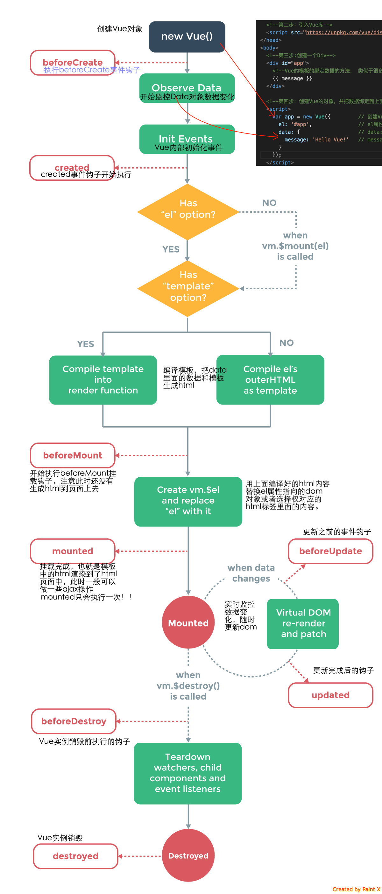

#### Vue钩子函数理解
#### 组件的生命周期钩子

##### 上面的图片中说明的很直白了,自己很清楚的认识到,大部分的生命周期在项目中并不会全部用到,这里需要注意几点:
- ==ajax请求最好放在==`created`里面,原因在于此时可以访问到`this`了.而请求到的数据你可以放在`data`里面.
之前在出去面试的时候,有问到过这个问题.
- ==关于dom操作的要放在`mounted`==里面,在`mounted`前面访问dom会报错,显示`undefined`.
 之前在项目中遇到页面样式高度问题,代码就是放在`mounted`中解决的.
- 每次进入/离开,组件都要做一些事情的,用什么样的钩子:
  1.不缓存: 进入的时候可以使用`created`和`mounted`,离开时候可以使用`beforeDestory`和`destoryed`钩子,`beforeDestory`可以访问到`this`,`destoryed`是步可以访问到`this`的.
  2.缓存了组件: 在你缓存了组件之后,再次进入组件的时候不会触发`beforeCreated`,`beforeMounted`,`created`,`mounted`. **如果你想每次进入组件做一些事情的话,在这里可以使用`activated`进入到缓存组件的钩子中.**
  同理的: 离开缓存组件的时候,`beforeCreated`和`destoryed`是不会触发的.可以使用`deactivated`离开缓存组件的钩子来代替.